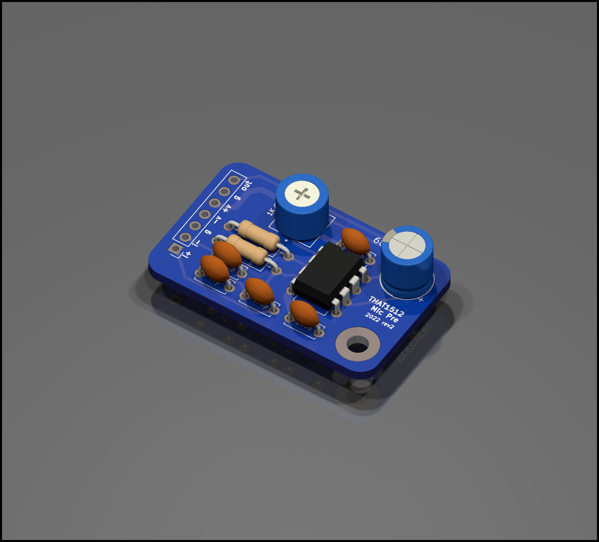

# THAT1512 Mic Pre
This is a very simple board with a THAT1512 based preamp for replacing the one in the Buchla 208 for a much lower noise floor and higher gain. Wire between the preamp jack and T.P.1 on card 10. Lower R6 on card 10 to compensate for the gain increase.

