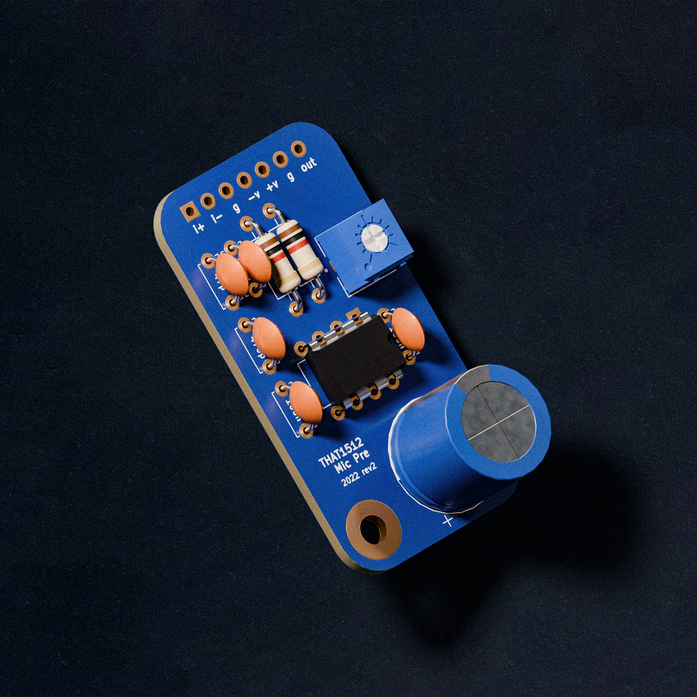

# THAT1512 Microphone Preamp
This is a very simple board with a THAT1512 based preamp for replacing the one in the Buchla 208 for a much lower noise floor and higher gain. Wire between the preamp jack and T.P.1 on card 10. Lower R6 on card 10 to compensate for the gain increase.

The board is 45 × 24 mm with a single M3 mounting hole. Gain is set by the 1K trimmer (RV1, a Bourns 3362P).

## Header pinout

Pin 1 is the square pad.

| Pin | 1 | 2 | 3 | 4 | 5 | 6 | 7 |
|---|---|---|---|---|---|---|---|
| | i+ | i− | g | −v | +v | g | out |
