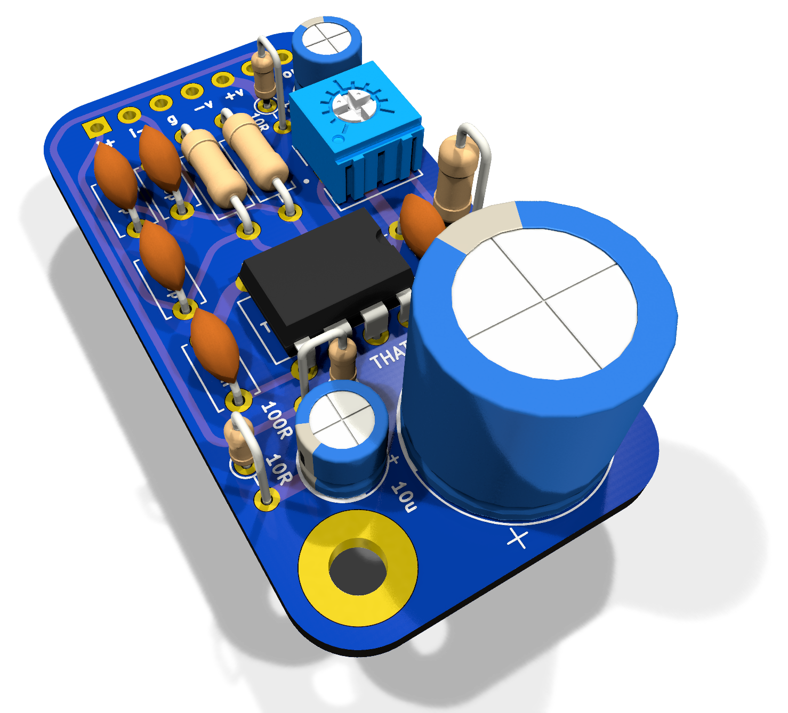

# THAT1512 Microphone Preamp
This is a very simple board with a THAT1512 based preamp for replacing the one in the Buchla 208 for a much lower noise floor and higher gain. Wire between the preamp jack and T.P.1 on card 10. Lower R6 on card 10 to compensate for the gain increase.

The board is 45 × 24 mm with a single M3 mounting hole. Gain is set by the 1K trimmer (RV1, a Bourns 3362P): about 15 dB at full resistance up to about 59 dB at zero, where the 5.6 Ω R6 sets the top of the range.

## Header pinout

Pin 1 is the square pad.

| Pin | 1 | 2 | 3 | 4 | 5 | 6 | 7 |
|---|---|---|---|---|---|---|---|
| | i+ | i− | g | −v | +v | g | out |

## Revisions

**rev3 (2026)** — same outline, header pinout and mounting hole as rev2, so it is a drop-in replacement.

- Corrected part numbers: U1 is THAT1512P08-U (was 1510), C4/C5 are 100 nF (were 470 pF part numbers), R1/R2 are 1 kΩ (were 6.81 kΩ part numbers), RV1 is 1 kΩ.
- R3 100 Ω in series with the output, to isolate the THAT1512 from the capacitance of the wire to card 10 (it is specified for 300 pF at most).
- R6 5.6 Ω in series with RV1, so maximum gain is set by a resistor rather than by the trimmer's end resistance.
- R4/C7 and R5/C8: 10 Ω and 10 µF on each supply rail.
- No output coupling capacitor is needed: card 10 AC-couples after T.P.1, and C6 holds the output offset to a few mV.

**rev2 (2022)** — the board fitted in the 208, tagged `rev2`. Its raytraced render is `thatmicpre_3D_render.png`.

## Bill of materials (rev3)

| Ref | Value | Part number | Notes |
|---|---|---|---|
| U1 | THAT1512 | THAT1512P08-U | DIP-8 |
| RV1 | 1 kΩ trimmer | Bourns 3362P-1-102LF | |
| C1, C2 | 470 pF | Murata RDE5C2A471J0M1H03A | C0G, 5 mm pitch |
| C3 | 47 pF | Murata RDE5C2A470J0M1H03A | C0G, 5 mm pitch |
| C4, C5 | 100 nF | Murata RDER71H104K0M1H03A | X7R, 5 mm pitch |
| C6 | 6800 µF | — | ≥6.3 V, 12.5 mm diameter, 5 mm pitch |
| C7, C8 | 10 µF 50 V | Panasonic EEU-FR1H100 | 5 mm diameter, 2 mm pitch |
| R1, R2 | 1 kΩ 0.1 % | Vishay CMF551K0000BEEK | |
| R3 | 100 Ω | Vishay MBA02040C1000FC100 | mounted vertically |
| R4, R5 | 10 Ω | Vishay MBA02040C1009FC100 | mounted vertically |
| R6 | 5.6 Ω | Vishay MBB02070C5608FCT00 | mounted vertically |
| J1 | 1×7 pin header | | 2.54 mm |
